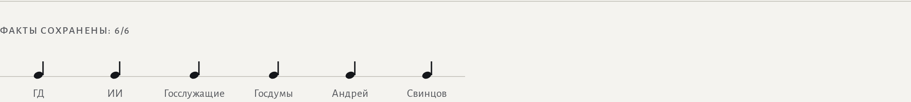

# Mood News

Читалка реальных новостей в разных эмоциональных регистрах: факты неизменны,
меняется только тон. Новости приходят из RSS русскоязычных агентств, переписывает
их LLM, а сохранность фактов проверяется кодом — не на слово модели.

Интерфейс сделан как нотная партитура: Mood — указание исполнения над строкой,
оригинал и переписанное — два стана под акколадой, Fact Check — ноты и паузы.

Подробности решений: [`CONTEXT.md`](./CONTEXT.md) и [`docs/adr/`](./docs/adr/).

## Скриншоты

Выпуск: главная новость плашкой, остальные — строками стана. Mood выбирается на
странице новости, где его слышно.


Страница новости: оригинал и переписанная версия рядом, внизу Fact Check и ссылка
на источник.


Fact Check: уцелевший Anchor — нота на линейке, потерянный — пауза, его текст
выделен.



## Стек

| Слой | Что |
|---|---|
| Сервер | Node 22, [Hono](https://hono.dev), TypeScript |
| База | SQLite через встроенный `node:sqlite` — без ORM и миграций |
| Фронт | React + TypeScript, [Vite](https://vitejs.dev) |
| Контракт API | общие zod-схемы в `shared/api.mts` |
| Тесты | встроенный `node:test` — без Vitest/Jest |
| LLM | любой OpenAI-совместимый эндпоинт, по умолчанию `glm-4.7-flash` (z.ai) |

Внешних зависимостей минимум: HTTP-фреймворк, React, zod. RSS, парсинг страниц,
извлечение фактов и хранение — свой код.

## Запуск

```bash
git clone https://github.com/DanGrigorenko/Mood-News && cd Mood-News
npm install              # ставит корень и оба пакета (server, web)
cp .env.example .env     # впиши LLM_API_KEY (бесплатный ключ на https://z.ai)
npm run dev              # сервер :8787 + фронт :5173
```

Открой http://localhost:5173 — новости появятся сами: при пустой базе сервер
делает Ingest на старте (несколько секунд). У каждой новости свой адрес
(`?n=<ссылка>`).

Три переменные в `.env` переключают провайдера: `LLM_BASE_URL`, `LLM_MODEL`,
`LLM_API_KEY` (z.ai, OpenRouter, Groq). `.env` читается флагом Node
`--env-file-if-exists`, без dotenv. Необязательный `DB_PATH` — путь к файлу
SQLite (по умолчанию `server/mood-news.db`).

**Без ключа** приложение работает: Rewrite отдаётся заглушкой с пометкой
`stub: true` и не кэшируется — как только ключ появится, генерация пойдёт
по-настоящему.

Проверки перед коммитом:

```bash
npm run typecheck   # tsc --noEmit в обоих пакетах
npm test            # node:test в обоих пакетах
```

Деплой: [`render.yaml`](./render.yaml) — один web-сервис, сервер отдаёт и `/api`,
и собранный `web/dist`. Достаточно подключить репозиторий в Render и задать
`LLM_API_KEY`.

## Откуда берутся новости

Ingest забирает статьи из RSS **Коммерсанта, РИА Новости, Интерфакса** (список в
`server/src/ingest.ts`). Лента отдаёт только анонс, поэтому Ingest идёт на
страницу публикации и берёт **полный текст** — он и хранится как Snippet
([ADR 0006](./docs/adr/0006-full-text-from-source-pages.md)). Каждый источник
парсится по правилу своей вёрстки (`server/src/article-text.ts`); реклама, меню и
«читайте также» отсекаются. ТАСС и Lenta.ru убраны — закрыты антиботом.

Правила отсева:

- **Нет полного текста — нет новости.** Заглушка, недоступная страница или
  подозрительно короткий обрывок в базу не попадают.
- **Служебная шапка срезается** («МОСКВА, 16 авг — РИА Новости.»): она
  принадлежит источнику, а не событию, и на короткой заметке даёт половину
  Anchor. Дата и источник и так показаны отдельными полями.
- **Порог длины** (`MIN_SNIPPET_LENGTH`, после среза): из двух предложений пять
  разных регистров не сделать, не добавляя отсебятины.

Ingest запускается на старте при пустой базе и повторно кнопкой «Обновить»;
`POST /api/ingest` отвечает, сколько добавлено и сколько пропущено. Дедупликация
по ссылке. Падение одной ленты или страницы не роняет остальные. Источник каждой
новости виден в интерфейсе и ведёт ссылкой на оригинал.

## Хранение

SQLite одним файлом: схема создаётся `CREATE TABLE IF NOT EXISTS` при старте,
ссылка статьи — PRIMARY KEY (на ней держится дедупликация). Данные переживают
перезапуск. Не Postgres — намеренно: проверяющему не нужен docker, база
создаётся сама.

Таблица `rewrites` ключуется парой «Article + Mood»: генерация ленивая, кэш
вечный ([ADR 0001](./docs/adr/0001-lazy-rewrites-cached-forever.md)). Первый
запрос пары медленный, повторный читается из базы.

## Переписывание тона

`GET /api/moods` отдаёт пять Mood: `neutral`, `joyful`, `sad`, `ironic`,
`dramatic`. Произвольный Mood отклоняется, а не уходит в модель.

`GET /api/articles/:id?mood=X` возвращает переписанные заголовок и тело плюс
результат Fact Check: список Anchor, список потерянных, число попыток и исход
Meaning Check. Промпт задаёт эмоциональный регистр и правила сохранности; сам
Outcome события неприкосновенен ([ADR 0007](./docs/adr/0007-outcome-is-immutable.md)):
Mood — позиция рассказчика, а не переоценка события.

В кэш пишется только прошедшее обе сверки. Провалившийся Rewrite показывается
читателю (лучшая попытка, не 500 и не откат на оригинал), но генерится заново при
следующем открытии ([ADR 0008](./docs/adr/0008-failed-rewrite-is-retried-not-displayed.md)).

## Как контролируются факты

Контроль двухступенчатый.

**1. Anchor-сверка — детерминированная.** Из Snippet до всякой модели механически
извлекаются Anchor: числа, даты, суммы, цитаты, имена
([ADR 0002](./docs/adr/0002-deterministic-anchor-fact-check.md)). После генерации
код проверяет присутствие каждого Anchor в заголовке и теле обычным сравнением
подстрок. Потеря → ретрай, где промпт называет потерянное и просит вернуть его,
сохранив уже полученный регистр.

Сверка кодом, а не моделью-судьёй: судья галлюцинирует, стоит денег на каждую
проверку и даёт разный ответ на один вход. Регулярки и `String.includes`
воспроизводимы, бесплатны и покрыты юнит-тестами без сети и ключа.

Промпт **первой** попытки перечня Anchor не содержит
([ADR 0009](./docs/adr/0009-anchors-are-a-post-check-not-a-prompt.md)): список
обязательных к сохранению фрагментов толкал модель к беспроигрышной стратегии —
вернуть источник слово в слово (замер на живой модели: 100% уцелевших триграмм
против 6–8% без списка). Anchor называются только в ретрае, и требование
расщеплено по виду: числа, даты, суммы и цитаты — дословно и цифрами; имена —
обязательно, но склонять можно (сверка сравнивает имя по первым пяти символам).
Отдельное правило запрещает приписывать факты перечнем в конце — свалка Anchor
списком была попыткой пройти сверку в обход переписывания.

**2. Meaning Check — второй проход модели.** Anchor-сверка не ловит переворот
исхода при дословно сохранённых числах: «рабочий погиб» → «рабочий успешно
завершил проект», а Fact Check отчитается «1/1». Поэтому прошедший первую ступень
Rewrite сверяется вторым вызовом с исходным Snippet на сохранность исхода,
направления и субъекта и на дорисованные факты — но не по тону
([ADR 0005](./docs/adr/0005-second-pass-meaning-review.md)). Найденное искажение
уходит в тот же цикл ретраев. Сбой самой сверки не роняет запрос: Rewrite
отдаётся с честной пометкой `skipped`, а не выдаётся за проверенный.

**Плюс порог непохожести.** `UNCHANGED_SIMILARITY_THRESHOLD` — доля словесных
триграмм Snippet, дословно уцелевших в Rewrite. Копия даёт около единицы, честное
переписывание — заметно меньше, поэтому копия с переставленными словами за
переписывание не проходит.

### Пример сработавшего ретрая

Реальная новость Коммерсанта. В драматичном регистре модель теряет число `56`
(«десятки пожарных»), Fact Check ловит потерю, вторая попытка её возвращает:

```
Article: https://www.kommersant.ru/doc/8890654
Anchor (8): «56», «14», «Wildberries», «Подольске», «WB», «Григорий», «Артамонов», «Telegram»

попытка 1: Огненный ад под Подольском: склад Wildberries (WB) охвачен пламенем
           Fact Check: потеряно «56» → ретрай
попытка 2: Огненный ад под Подольском: 56 пожарных бьются со стихией на складе Wildberries (WB)
           Fact Check: все Anchor на месте → успех
```

Воспроизводится: `node .sandcastle/retry-demo.ts`. Цикл, извлечение Anchor и Fact
Check настоящие; ответы модели заскриптованы, чтобы потеря случилась
детерминированно.

### Замер качества промпта (eval)

`npm run eval --prefix server` гоняет замороженный корпус 10 Snippet × 5 Mood
(`server/eval/corpus.json`) против живой модели и печатает сводку против планки:
50/50 по потерянным Anchor, 50/50 по порогу непохожести, не ниже 48/50 по Meaning
Check (детерминированные проверки — абсолют, недетерминированный судья — с
допуском на шум). Корпус снят с настоящих статей, один взят у самой границы порога
длины. Команда стоит денег и недетерминирована, поэтому в `npm test` и CI не
входит.

## Что использовали из AI

AI ровно в одном месте — переписывание тона (`server/src/rewrite.ts`,
`prompt.ts`, `llm.ts`): Snippet уходит в LLM с промптом, задающим регистр и
правила сохранности фактов. Второй вызов той же модели — Meaning Check. Всё
остальное — Ingest, извлечение Anchor, Fact Check, хранение, порог непохожести —
обычный детерминированный код без модели.

Модель по умолчанию: `glm-4.7-flash` от z.ai (бесплатная), обращение по
OpenAI-совместимому HTTP, провайдер меняется тремя переменными окружения.

## Структура

Два независимых пакета без workspaces, оркестрация через `concurrently`:

- `server/` — HTTP API на Hono; самостоятельный сервис, не завязанный на фронт.
- `web/` — React + Vite; запросы к `/api` Vite проксирует на сервер, абсолютных
  URL с портом в коде фронта нет.
- `shared/` — zod-схемы API, общие для обоих.

Скриншоты сняты с запущенного приложения через Playwright:
`npx playwright install chromium`, затем `node .sandcastle/shots.mjs`.
